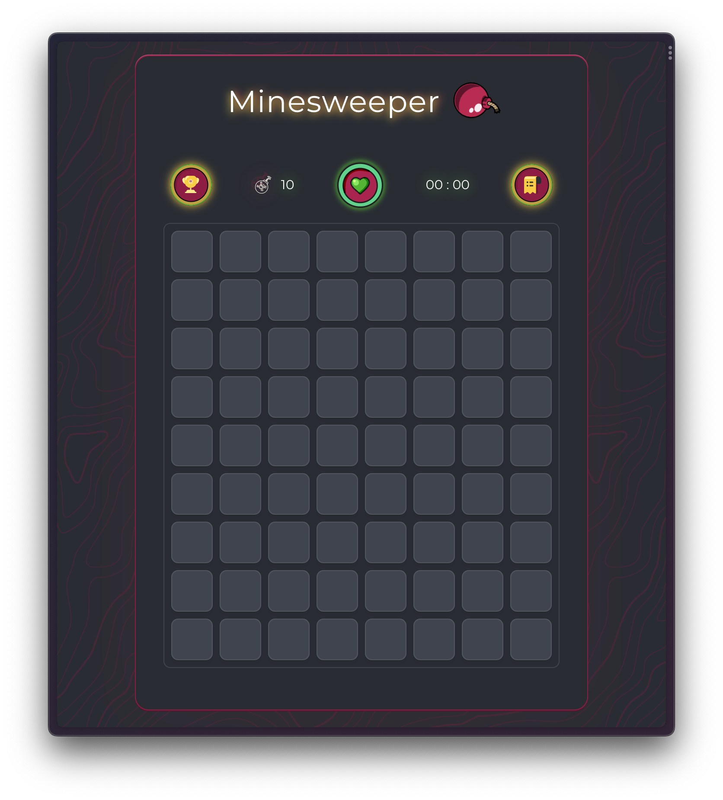
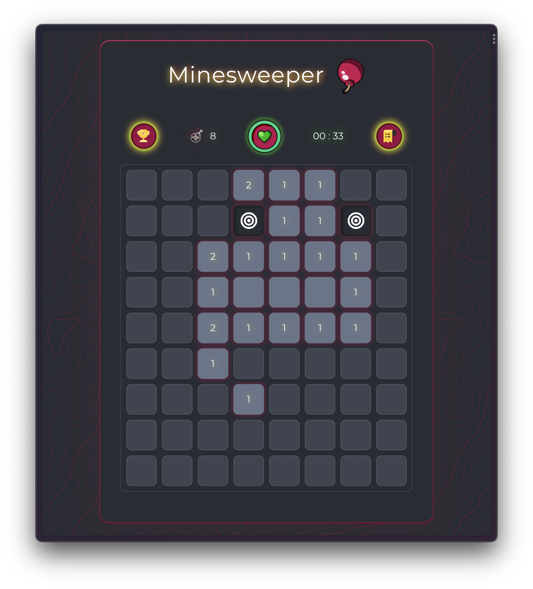

# Minesweeper Game

## 🌟 Welcome to Minesweeper!

Explore my implementation of the classic Minesweeper game, crafted with modern web technologies and designed to provide an engaging and enjoyable experience.

### 🕹️ Play the Game

Dive into the challenge of uncovering all the non-mine squares while avoiding hidden mines. Test your strategy and problem-solving skills with every click!

### 🚀 Features

- **Interactive gameplay**: Experience the traditional Minesweeper game with a fresh and intuitive interface. 
- **Helpful tips**: Access handy tips and tricks within the game to improve your strategy and increase your chances of winning.
- **Smooth animations**: Enjoy visually appealing animations that bring the game to life, especially during resets 🗿.
- **Record tracking**: Keep track of your best times and strive to improve your skills with every game. 

### 🛠️ Technologies Used

- Vue.js: Leveraging the power of Vue.js for a dynamic and reactive user interface.
- Local Storage: Ensuring your win/loss records are saved locally, allowing you to track your progress.

### 📚 About this Project

This Minesweeper game is a personal project that I've built to challenge myself and hone my skills in web development. Inspired by the classic puzzle game, I aimed to recreate the fun and strategy of Minesweeper using modern web technologies.

### 🌐 Visit and Play

Experience the game live on GitHub Pages:
[Play Minesweeper](https://bakanesique1337.github.io/minesweeper.vue/)

### 🖥️ Screenshots





### 🤝 Contributions and Feedback

Feel free to explore the code, contribute, or provide feedback. I'm always open to improving and learning!

## 🛠️ Setting Up the Project Locally

If you'd like to set up and run this project on your local machine, follow these steps:

### Prerequisites

Make sure you have the following installed on your system:

- Node.js (version 14.x or later)
- npm

### Clone the Repository

1. Start by cloning the repository to your local machine using Git. Open your terminal and run the following command:

```shell
git clone https://github.com/bakanesique1337/minesweeper.vue.git
```

2. Install Dependencies

```shell
npm install
```

3. Run the Development Server

```shell
npm run dev
```
This will start the project, and you can view it in your browser at http://localhost:8080 (or another port if specified).
